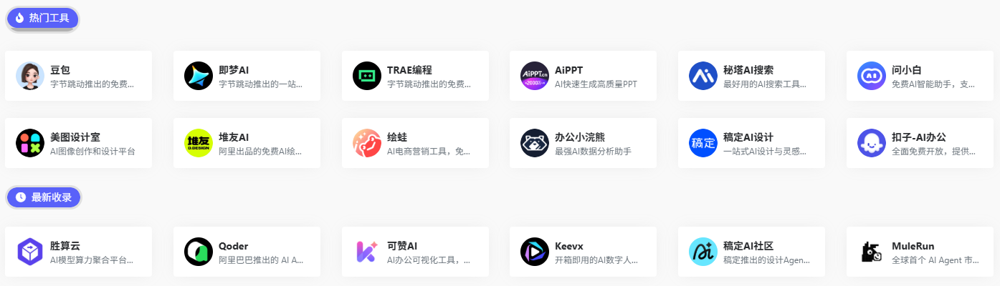
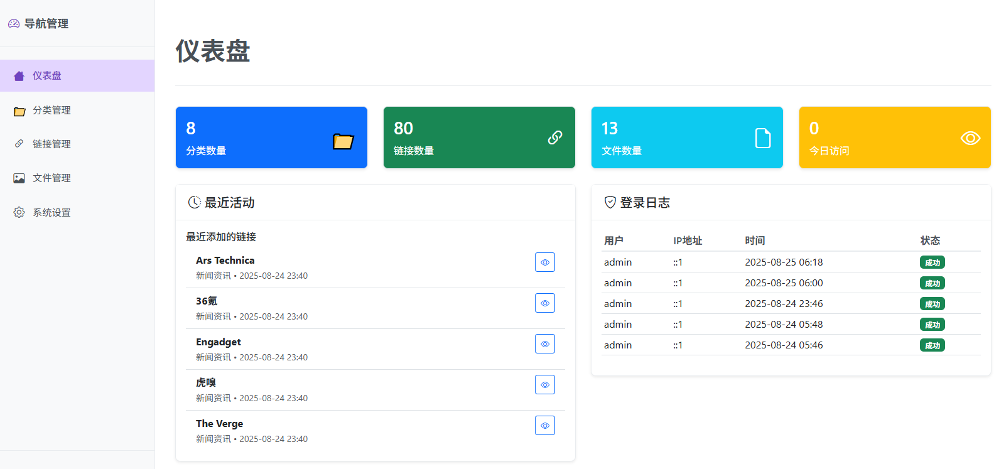

# 🌐 导航网站 - 纯PHP版本

一个简洁高效的网址导航网站，使用纯PHP + MySQL开发，无需复杂环境，开箱即用。

## ✨ 核心功能

### 📊 分类管理
- ✅ 无限级分类支持
- ✅ 分类图标自定义（支持Font Awesome图标、本地上传、URL）
- ✅ **分类名称颜色自定义** - 每个分类支持独立设置文字颜色
- ✅ **Font Awesome图标颜色设置** - 所有图标支持自定义颜色
- ✅ 分类排序和显示控制
- ✅ 分类统计和计数

### 🔗 链接管理
- ✅ 批量添加/编辑链接
- ✅ 链接图标和描述
- ✅ 链接访问统计
- ✅ 链接排序和分组
- ✅ 链接状态管理

### 🎨 个性化定制
- ✅ **高度可定制化设置** - 所有外观元素支持精细调整
- ✅ **背景多样化支持** - 无背景、纯色背景、本地上传图片、第三方API背景
- ✅ **本地Font Awesome图标库** - 内置图标库，解决网络不畅问题
- ✅ **网站Logo灵活配置** - 支持上传图片或使用Font Awesome图标
- ✅ **分类图标多种选择** - Font Awesome图标、本地上传图片、图片URL
- ✅ **链接图标丰富支持** - Font Awesome图标、本地上传图片、图片URL
- ✅ **文件管理清理** - 智能查找和删除冗余图片文件
- ✅ **首页模块透明度调整** - 标题栏、分类区、链接区、卡片透明度独立控制
- ✅ **主题颜色切换** - 全局主题色一键更换
- ✅ **页脚内容自定义** - 个性化页脚信息设置
- ✅ 响应式设计（手机/平板/电脑）

### 🔐 管理后台
- ✅ 安全的登录认证
- ✅ 分类和链接的CRUD操作
- ✅ 系统设置管理
- ✅ 操作日志记录

### 🚀 性能优化
- ✅ 数据库索引优化
- ✅ 静态资源缓存
- ✅ API响应优化
- ✅ 图片懒加载

## 🚀 快速部署

### 1️⃣ 环境要求
- **PHP**: 7.4+
- **MySQL**: 5.7+ 或 MariaDB 10.2+
- **扩展**: pdo_mysql

### 2️⃣ 一键安装
1. **上传文件**到网站根目录
2. **访问安装向导**: `http://yourdomain.com/install.php`
3. **填写数据库信息**完成安装
4. **访问后台**: `http://yourdomain.com/admin/`

### 3️⃣ 默认账号
- **用户名**: admin
- **密码**: admin123

## 👀 预览展示

### 🖥️ 网站前台


### 🎛️ 网站后台


## 📁 项目结构

```
navi/
├── index.php          # 网站首页
├── install.php        # 一键安装向导
├── admin/             # 管理后台
│   ├── index.php      # 后台入口
│   ├── dashboard.php  # 仪表盘
│   ├── categories/    # 分类管理
│   ├── links/         # 链接管理
│   └── settings/      # 系统设置
├── uploads/           # 上传文件（背景、分类、链接图标）
├── assets/            # 静态资源（Font Awesome等）
├── css/               # 样式文件
├── js/                # JavaScript
└── views/             # 页面模板
```


## 🎯 使用场景

- **个人导航站**: 收藏常用网站
- **团队工具箱**: 团队共享工具链接
- **公司内网**: 企业内部资源导航
- **垂直导航**: 特定领域网站聚合

## 🛠️ 技术特色

- **零依赖**: 纯PHP开发，无需Node.js
- **轻量级**: 核心代码简洁高效
- **易扩展**: 模块化设计，方便二次开发
- **响应式**: 完美适配各种设备
- **安全**: 防SQL注入，XSS防护

## 📞 技术支持

如有问题，请检查：
- 数据库连接配置
- PHP错误日志
- 浏览器控制台信息

---

**🌟 立即开始您的导航网站之旅！**