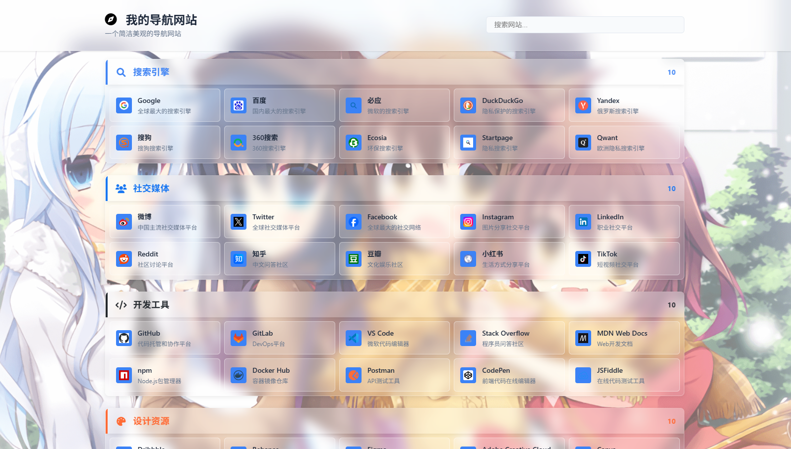

# 🌐 导航网站 - 纯PHP版本

一个简洁高效的网址导航网站，使用纯PHP + MySQL开发，无需复杂环境，开箱即用。

## 👀 预览展示

### 🖥️ 网站前台

### 🎛️ 网站后台

## ✨ 核心功能

### 📊 内容管理
**分类系统**
- ✅ 无限级分类支持，层级结构清晰
- ✅ 分类状态管理（显示/隐藏）
- ✅ 分类排序和统计功能

**链接管理**
- ✅ 批量添加/编辑链接，操作高效
- ✅ 链接访问统计，数据分析
- ✅ 链接状态控制，灵活管理

### 🎨 视觉定制
**主题外观**
- ✅ 多种背景模式：纯色、本地图片、第三方API
- ✅ 模块化透明度控制（标题栏、分类区、链接区、卡片）
- ✅ 响应式设计，完美适配手机/平板/电脑

**图标系统**
- ✅ 本地Font Awesome图标库，无需网络依赖
- ✅ Iconfont图标支持，可自定义图标库
- ✅ 分类图标：FontAwesome、Iconfont、本地上传、URL链接
- ✅ 链接图标：多种图标类型自由选择
- ✅ 全图标颜色自定义，色彩搭配灵活

**品牌定制**
- ✅ 网站Logo：图片上传、FontAwesome图标或Iconfont图标
- ✅ 主题颜色一键切换
- ✅ 页脚内容自定义
- ✅ 网站图标和描述设置

### 🔐 系统管理
**后台管理**
- ✅ 安全的登录认证系统
- ✅ 分类和链接的完整CRUD操作
- ✅ 系统设置集中管理

**性能优化**
- ✅ 数据库索引优化，查询高效
- ✅ 静态资源缓存机制
- ✅ 图片懒加载，加载流畅

**安全保护**
- ✅ 防SQL注入攻击
- ✅ XSS跨站脚本防护
- ✅ 输入数据严格验证

## 🚀 快速部署

### 1️⃣ 环境要求
- **PHP**: 7.4+
- **MySQL**: 5.7+ 或 MariaDB 10.2+
- **扩展**: pdo_mysql

### 2️⃣ 一键安装
1. **上传文件**到网站根目录
2. **访问安装向导**: `http://yourdomain.com/install.php`
3. **填写数据库信息**完成安装
4. **访问后台**: `http://yourdomain.com/admin/`

### 4️⃣ Iconfont图标配置（可选）
1. **注册阿里iconfont账号**: https://www.iconfont.cn
2. **创建项目**并添加所需图标
3. **获取项目链接**: 在iconfont项目中复制"Symbol"类型的JS链接
4. **配置到后台**: 进入后台 → 设置 → 外观 → 阿里iconfont地址，粘贴链接
5. **使用图标**: 在分类或链接设置中选择"Iconfont"类型，输入图标名称（如: icon-a-appround51）

## 🎯 使用场景

- **个人导航站**: 收藏常用网站
- **团队工具箱**: 团队共享工具链接
- **公司内网**: 企业内部资源导航
- **垂直导航**: 特定领域网站聚合

## 🛠️ 技术特色

- **零依赖**: 纯PHP开发，无需Node.js
- **轻量级**: 核心代码简洁高效
- **易扩展**: 模块化设计，方便二次开发
- **响应式**: 完美适配各种设备
- **安全**: 防SQL注入，XSS防护

## 📞 技术支持

如有问题，请检查：
- 数据库连接配置
- PHP错误日志
- 浏览器控制台信息

---

**🌟 立即开始您的导航网站之旅！**